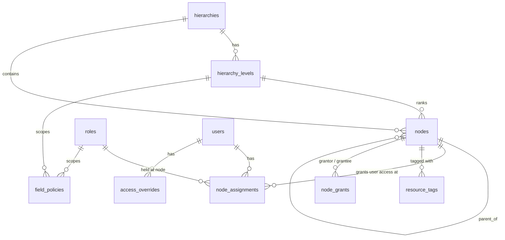

# Part 2 — Data Access Control (Design)

Worked example uses **product + field visibility**, but nothing in the model is
product-specific. Every table keys resources as `(resource_type, resource_id)`,
so the same machinery serves ordering, delivery status, invoices, etc.

---

## 1. Design decisions up front

| Decision | Choice | Why |
|---|---|---|
| Arbitrary depth | **Adjacency list** (`nodes.parent_id`) + optional materialized `path` | Adding a level = insert rows. No migration. Nested-set / closure-table are write-heavy; noted as the upgrade path if subtree reads ever dominate. |
| Level names | Separate `hierarchy_levels` table, ordered by `depth` | Admin "defines the levels" as data; gives validation and a UX surface. Not load-bearing for resolution. |
| Reuse beyond products | Generic `resource_type` + `resource_id` on tags, grants, policies, overrides | One set of tables for the whole portal. No per-domain access tables. |
| Row vs column | Two independent axes | Row = *which products appear in the listing*. Column = *which fields of a listed product are populated*. |
| Top-down delegation | A node is either **open** (children inherit everything at/below) or **delegated** (`nodes.delegated = true`: children see only what the parent explicitly grants down) | Simple orgs pay nothing. Orgs that need "Division controls what Region sees" flip one flag. |
| Conflict resolution | **Explicit beats implicit; deny beats allow; specific beats broad** | Fail-closed. Cost/margin leaking is worse than an annoyed user asking for access. |

---

## 2. Schema



### 2.1 `hierarchies`
| column | type | notes |
|---|---|---|
| id | pk | |
| name | text | e.g. `Sales Territory`, `Brand Structure` |
| description | text | |

An org can define more than one hierarchy.

### 2.2 `hierarchy_levels`
| column | type | notes |
|---|---|---|
| id | pk | |
| hierarchy_id | fk hierarchies | |
| depth | int | 0 = root rank |
| name | text | `Division`, `Country`, `Salesperson` |

Unique `(hierarchy_id, depth)`. Adding `Sub-account` = one insert.

### 2.3 `nodes`
| column | type | notes |
|---|---|---|
| id | pk | |
| hierarchy_id | fk hierarchies | |
| parent_id | fk nodes, null | null = root |
| level_id | fk hierarchy_levels, null | |
| name | text | `EMEA`, `Germany`, `Alice` |
| delegated | bool default false | if true, children get **nothing** by default; parent must `node_grants` it down |
| path | text | denormalized `/1/7/23/`, maintained on write — subtree queries without a recursive CTE. Optional. |

### 2.4 `roles`
| column | type | notes |
|---|---|---|
| id | pk | |
| name | text | `sales`, `manager`, `finance` |

Just a label. No permission rows attached here — `field_policies` reference it.

### 2.5 `node_assignments` — *multiple assignments per user*
| column | type | notes |
|---|---|---|
| id | pk | |
| user_id | fk users | |
| node_id | fk nodes | |
| role_id | fk roles, null | role the user holds **at this node** — drives column visibility for rows seen via this node |
| include_descendants | bool default true | assignment cascades to the subtree |

A user can have many rows here — two countries, different roles per country.

### 2.6 `resource_tags` — *row-level tagging*
| column | type | notes |
|---|---|---|
| id | pk | |
| node_id | fk nodes | |
| resource_type | text | `product`, `order`, `delivery` |
| resource_id | text | SKU / order id / … |

Unique `(node_id, resource_type, resource_id)`. A product may be tagged to
several nodes.

### 2.7 `node_grants` — *top-down delegation*
Only consulted when crossing a `delegated` node boundary.

| column | type | notes |
|---|---|---|
| id | pk | |
| grantor_node_id | fk nodes | the parent doing the granting |
| grantee_node_id | fk nodes | a descendant receiving |
| resource_type | text | |
| resource_id | text, null | a specific resource … |
| tag_node_id | fk nodes, null | … **or** "everything currently tagged to this node" (bulk grant) |
| effect | enum(`allow`,`deny`) default `allow` | `deny` = parent carve-out inside a broader allow |

Check: exactly one of `resource_id` / `tag_node_id` is set.

### 2.8 `field_policies` — *column-level, configurable*
| column | type | notes |
|---|---|---|
| id | pk | |
| resource_type | text | |
| field_name | text | `price`, `stock`, `cost`, `margin` |
| role_id | fk roles, null | |
| level_id | fk hierarchy_levels, null | |
| node_id | fk nodes, null | optional node-specific rule |
| effect | enum(`allow`,`deny`) | |

At least one of `role_id` / `level_id` / `node_id` set. A field is visible if a
matching `allow` exists and no matching `deny`. Fields with no matching policy
fall to `field_defaults(resource_type)` — default `deny` (whitelist model);
base identity fields like `sku`, `name` are always allowed.

### 2.9 `access_overrides` — *per-user, per-resource*
| column | type | notes |
|---|---|---|
| id | pk | |
| user_id | fk users | |
| resource_type | text | |
| resource_id | text | |
| effect | enum(`allow`,`deny`) | |
| reason | text | |
| created_by | fk users | |
| created_at | timestamp | |

Unique `(user_id, resource_type, resource_id)`.

---

## 3. Resolution & precedence

### 3.1 Row-level — does user *U* see resource *R*?

**Step 1 — build the visible set per assignment.** For each `node_assignment`
of U, walk the path from the hierarchy root down to the assigned node:

- start with the root's visible set = every resource of that type tagged at or
  below the root;
- at each **open** node: inherit the parent's set unchanged;
- at each **delegated** node: `visible = { r ∈ parent.visible : ∃ allow grant
  to this node (direct resource or via tag_node) AND no deny grant }`.

The set can only ever **shrink** as you descend a delegated boundary — a child
can never see more than its parent held.

**Step 2 — union** the visible sets across all of U's assignments.

**Step 3 — apply precedence** (highest wins):

| # | Rule | Beats |
|---|---|---|
| 1 | `access_overrides` for `(U, R)` — `deny` wins over `allow` if both somehow exist | everything |
| 2 | delegation `deny` (`node_grants.effect = 'deny'` on U's path) | 3, 4 |
| 3 | R is in U's unioned visible set → **allow** | 4 |
| 4 | default → **deny** | — |

### 3.2 Why this order

- **Explicit beats implicit.** An override or an explicit `deny` grant is a
  human typing a decision about a specific thing. Hierarchy visibility is a
  side effect of org structure. The typed decision should win.
- **Deny beats allow at equal specificity.** Fail-closed. Re-granting after a
  complaint is cheap; un-leaking `cost` / `margin` is not.
- **Specific beats broad.** `(user, resource)` override > subtree-scoped
  delegation grant > "everything tagged below me".
- **Consequence, stated on purpose:** an admin `allow` **override can
  re-expose** a resource that a parent node denied via delegation. The
  Super Admin / Administrator sits *above* the delegation chain, so a
  deliberate top-level grant outranks a mid-tree revoke. If an org needs
  delegation to be absolute, model the override with a `node_id` scope and run
  it through the same path walk — same tables, one extra column.

### 3.3 Column-level

Independent of row resolution. For a resource U *can* see:

- evaluate `field_policies` for U's **role and level on the assignment that
  made the row visible** — `allow` present and no `deny` → field shown;
- a row made visible only by an `access_overrides` allow has no role attached →
  fall back to U's **least-privileged role** across all assignments (fail-closed);
- denied field → omitted / nulled in the response; the **row still lists**.

Row denied → not listed at all, regardless of fields.

### 3.4 Subtree query

```sql
WITH RECURSIVE subtree AS (
  SELECT id FROM nodes WHERE id = :node_id
  UNION ALL
  SELECT n.id FROM nodes n JOIN subtree s ON n.parent_id = s.id
)
SELECT id FROM subtree;
-- or, with materialized path:  WHERE path LIKE :node_path || '%'
```

---

## 4. Worked example

### 4.1 Hierarchy

`hierarchies`: **Sales Territory**

`hierarchy_levels`: depth 0 `Division`, depth 1 `Country`, depth 2 `Salesperson`

`nodes`:

```
1  EMEA        Division     parent=∅   delegated=TRUE
2  Germany     Country      parent=1
3  France      Country      parent=1
4  Alice       Salesperson  parent=2
5  Bob         Salesperson  parent=3
6  APAC        Division     parent=∅   delegated=FALSE
7  Japan       Country      parent=6
```

### 4.2 Products (mirrored from ERP) and tags

| SKU | name | tagged to |
|---|---|---|
| SKU-100 | Widget | Germany (2) |
| SKU-101 | Gadget | Germany (2) |
| SKU-102 | Sprocket | France (3) |
| SKU-103 | Gizmo | EMEA (1) — division-wide |
| SKU-200 | Doohickey | Japan (7) |

### 4.3 Roles & field policies (`resource_type = product`)

| role | allowed fields (via `field_policies`) |
|---|---|
| `sales` | `price`, `stock` |
| `manager` | `price`, `stock`, `cost`, `margin` |

`sku`, `name` always allowed. `cost`, `margin` have no `sales` allow → denied for `sales`.

### 4.4 User: **Carol** — multiple assignments, different roles

| assignment | node | role | include_descendants |
|---|---|---|---|
| A | Germany (2) | `sales` | true |
| B | France (3) | `manager` | true |

### 4.5 Delegation — EMEA controls what its countries see

`node_grants` (grantor = EMEA / 1):

| # | grantee | target | effect | meaning |
|---|---|---|---|---|
| G1 | Germany (2) | tag_node = Germany (2) | allow | everything tagged to Germany |
| G2 | Germany (2) | SKU-103 | allow | also the division-wide Gizmo |
| G3 | Germany (2) | SKU-101 | **deny** | …but **not** Gadget (carve-out) |
| G4 | France (3) | tag_node = France (3) | allow | everything tagged to France |

EMEA does **not** grant SKU-103 to France.

### 4.6 Overrides

| # | user | resource | effect | reason |
|---|---|---|---|---|
| O1 | Carol | SKU-200 Doohickey | allow | one-off cross-region deal |
| O2 | Carol | SKU-100 Widget | **deny** | conflict-of-interest block |

### 4.7 Resolve rows for Carol

**Via assignment A (Germany), crossing delegated EMEA:**
- EMEA root visible = tags at/below node 1 = `{100, 101, 102, 103}`
- EMEA→Germany boundary: G1 → `{100,101}`; G2 → `+103`; G3 → `−101` ⇒ **`{100, 103}`**
- Germany is open ⇒ Carol@Germany = `{100, 103}`

**Via assignment B (France), crossing delegated EMEA:**
- EMEA→France boundary: G4 → `{102}` (no grant for 103) ⇒ **`{102}`**
- Carol@France = `{102}`

**Union:** `{100, 102, 103}`

**Precedence:**
- O2 deny SKU-100 ⇒ drop `100`
- O1 allow SKU-200 ⇒ add `200` (overrides "not in any visible set")

**Carol sees rows: SKU-102, SKU-103, SKU-200.**

| SKU | why NOT visible |
|---|---|
| SKU-100 Widget | in her Germany set, but override **O2 deny** |
| SKU-101 Gadget | EMEA carve-out **G3 deny**; no other path |

### 4.8 Resolve fields for Carol

| SKU | seen via | role | sku | name | price | stock | cost | margin |
|---|---|---|---|---|---|---|---|---|
| SKU-102 Sprocket | assignment B | `manager` | ✓ | ✓ | ✓ | ✓ | ✓ | ✓ |
| SKU-103 Gizmo | assignment A | `sales` | ✓ | ✓ | ✓ | ✓ | ✗ | ✗ |
| SKU-200 Doohickey | override O1 (no role) | least-priv = `sales` | ✓ | ✓ | ✓ | ✓ | ✗ | ✗ |

**Cannot see fields:** `cost`, `margin` on SKU-103 and SKU-200 (role `sales`).

### 4.9 What this example exercised

user-defined level names · arbitrary depth via adjacency list · resource→node
tagging · multiple assignments with different roles · top-down delegation with
bulk `allow` + specific `deny` carve-out · per-user `allow` **and** `deny`
overrides · role-based column control · documented precedence, including an
override deliberately outranking a delegation deny.
